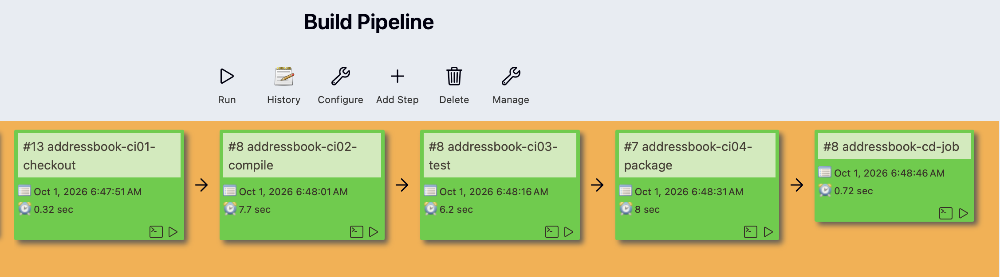
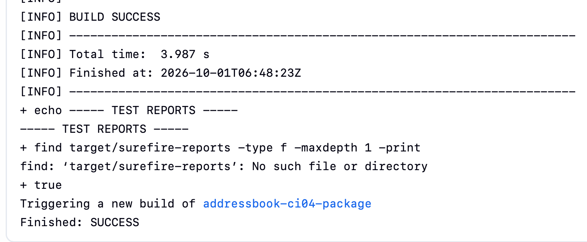
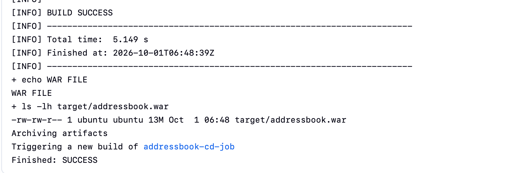
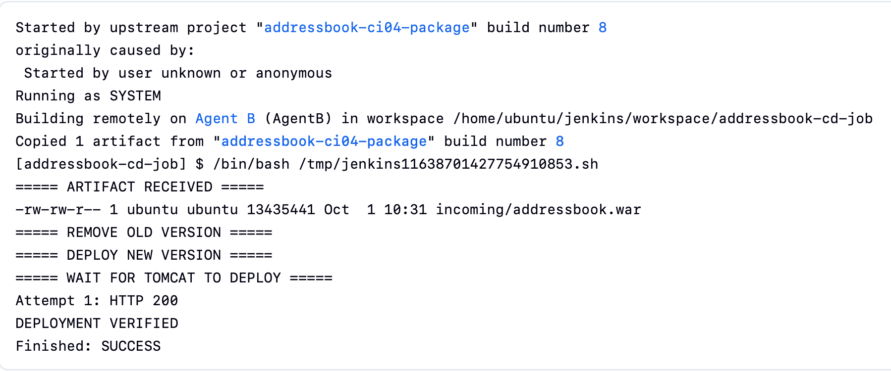
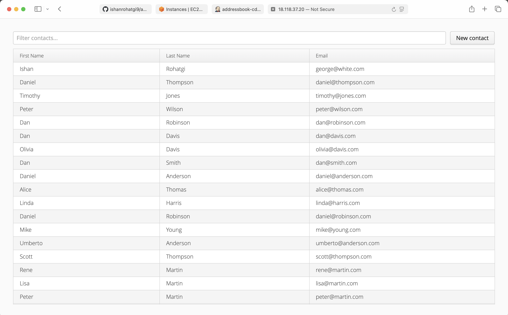

### AddressBook - CI/CD Pipeline with Jenkins

A Java web application deployed through an end-to-end CI/CD pipeline using Jenkins.

The application is built with Maven, tested with JUnit, packaged as a WAR file and deployed to Apache Tomcat through separate Jenkins CI and CD jobs.

## What I built

The project uses Jenkins to automate delivery process:
```text
Developer
    |
    v
  GitHub
    |
    v
Jenkins Controller
    |
    +------------------+
    |                  |
    v                  v
 CI Agent           CD Agent
    |                  |
    |-- Checkout       |
    |-- Compile       |
    |-- Test          |
    |-- Package       |
    |                  |
    +-- addressbook.war
                       |
                       v
                    Tomcat
                       |
                       v
               Running Application
```
The CI and CD stages are separated so that the deployment job uses the WAR artifact produced by the build instead of rebuilding the application.

## CI Pipeline

The CI side is divided into four Jenkins Freestyle jobs:

1. Checkout
2. Compile
3. Test
4. Package

The package job creates:

    target/addressbook.war

The WAR file is then archived by Jenkins and used by the deployment job.

## CD Pipeline

The deployment job:

1. Retrieves the archived WAR from Jenkins
2. Copies it to the deployment server
3. Removes the previous application version
4. Deploys the new WAR to Apache Tomcat
5. Checks the application endpoint
6. Marks the deployment successful after receiving HTTP 200

## Application

The application is a Java AddressBook web application.

It contains:

- Contact management classes
- AddressBook logic
- JUnit tests
- Web UI
- Maven build configuration

The application is packaged as a WAR and deployed under:

    /addressbook/

## Technologies

- Java
- Maven
- JUnit
- Git
- GitHub
- Jenkins
- Jenkins Freestyle Jobs
- Apache Tomcat
- Linux
- Bash
- CI/CD

## Jenkins Jobs

| Job | Purpose |
|---|---|
| addressbook-ci-1-checkout | Checkout source code from GitHub |
| addressbook-ci-2-compile | Compile the Java application |
| addressbook-ci-3-test | Run JUnit tests |
| addressbook-ci-4-package | Build and archive the WAR |
| addressbook-cd | Deploy the WAR to Tomcat |

## Testing

The test stage runs the application's JUnit test suite through Maven.

Latest successful run:

Tests run: 5
Failures: 0
Errors: 0
Skipped: 0

## Deployment Verification

The CD job performs an HTTP check after deployment.

The deployment was verified with an HTTP 200 response.

This allows the Jenkins job to fail if the application does not become available.

## Screenshots

### Jenkins Pipeline



### Test Results



### WAR Artifact



### Deployment



### Application



## Project Structure

    addressbook/
    ├── src/
    │   ├── main/
    │   └── test/
    ├── pom.xml
    ├── .gitignore
    ├── jenkins/
    ├── deployment/
    └── docs/

## What I learned

- Configuring Jenkins Controller and agents
- Running Jenkins jobs on specific agents
- Using Maven for Java builds
- Running automated tests through Jenkins
- Creating and archiving WAR artifacts
- Passing artifacts between Jenkins jobs
- Deploying applications to Apache Tomcat
- Adding deployment verification to a CI/CD workflow
- Separating CI and CD responsibilities

## Future Improvements

The current implementation uses Jenkins Freestyle jobs to make each stage of the CI/CD process visible.

The next step is to convert the same workflow to a Jenkinsfile and implement the pipeline as code.
